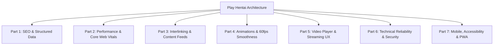

# Play Hentai — Master Audit, SEO, Performance & Technical Roadmap

This document serves as the permanent, in-repository reference for all technical SEO standards, Core Web Vitals performance benchmarks, animation smoothness guidelines, crawl hierarchy, and architectural health across **Play Hentai** (`playhentai.live`).

---

## Architecture Overview



---

## PART 1: Search Engine Optimization (SEO) & Structured Data Matrix

### 1. Title Tag & SERP Optimization
* **Length Budget**: Maximum 60 characters (~580px width) to avoid truncation in Google search results.
* **Format Structure**:
  * Home: `Play Hentai – Watch Hentai Anime Online Free in HD`
  * Series: `{Title} — Watch & Episodes | Play Hentai`
  * Episodes: `{Title} Episode {N} — Watch Online | Play Hentai`
  * Hubs/Directories: `{Genre / Studio / Category} | Play Hentai`
* **Root Template Rule**: Root layout in `src/app/layout.tsx` must use `template: "%s"` so pages specifying full branded titles do not get duplicated (`| Play Hentai | Play Hentai`).

### 2. Meta Descriptions
* **Length**: 150–160 characters.
* **Target Keywords**: Include high-intent search terms: "watch online in HD", "English subtitles", "uncensored", "streaming".
* **Distinctiveness**: Every page and dynamic catalog must provide a unique description.

### 3. XML Sitemaps
* **Main Dynamic Sitemap (`/sitemap.xml`)**:
  * Generated via `src/app/sitemap.ts`.
  * Indexes all published static routes (`/`, `/genres`, `/categories`, `/trending`, `/3d`, `/uncensored`, `/upcoming`, `/ongoing`, `/completed`, `/recent/series`, `/recent/episodes`, `/playlists`, `/studios`, `/faq`, `/terms`, `/privacy`).
  * Dynamically crawls all published series, episodes, studio directories, release years, and tags.
* **Google Video Sitemap (`/sitemap-video.xml`)**:
  * Generated via `src/app/sitemap-video.xml/route.ts`.
  * Complies with Google Video 1.1 XML schema:
    * `<video:thumbnail_loc>`: High-res poster/cover image with hero banner fallback.
    * `<video:title>`: Descriptive episode title.
    * `<video:description>`: Plot summary.
    * `<video:content_loc>`: Direct Cloudflare R2 MP4 video source URL.
    * `<video:duration>`: Integer seconds (1 to 28,800).
    * `<video:publication_date>`: ISO 8601 timestamp.
    * `<video:family_friendly>no</video:family_friendly>`: Explicit adult content flag for Google SafeSearch compliance.
    * `<video:uploader info="https://playhentai.live">Play Hentai</video:uploader>`
    * `<video:tag>`: Up to 32 tags (≤32 chars each).

### 4. Canonical URLs
* **Self-Canonical Rule**: Every indexable page must point to its exact, canonical URL.
* **Query Parameter Sanitization**: Clean index routes (e.g. `/playlists`) must canonicalize to the root path `/playlists` rather than self-canonicalizing query tab variations (`/playlists?tab=popular`), preventing duplicate content warnings in Google Search Console.

### 5. Structured Data (Schema.org / JSON-LD)
* **`WebSite`**: Declared in `layout.tsx` with `@id: https://playhentai.live/#website` and `SearchAction` entry point pointing to `https://playhentai.live/search?q={search_term_string}`.
* **`Organization`**: Publisher branding and official logo.
* **`TVSeries`**: Series detail pages with series name, English alternative title, genres, ratings, and episode lists.
* **`VideoObject`**: Watch pages with name, duration (`PT...`), uploadDate, thumbnail URL, and stream URLs.
* **`BreadcrumbList`**: Full breadcrumb trail on all subpages (Home > Category/Hub > Title).
* **`CollectionPage` & `ItemList`**: Catalog pages (`/genres`, `/studios`, `/playlists`).
* **`FAQPage`**: Question and Answer schema on `/faq`.

### 6. Heading Hierarchy
* **Rule**: Strictly one `<h1>` tag per page containing the primary keyword.
* Subsections use `<h2>`, and cards/filters use `<h3>`. No skipped heading levels.

---

## PART 2: Performance & Core Web Vitals (CWV)

### 1. TTFB (Time to First Byte)
* **Eliminate Synchronous Disk I/O**:
  * Never use `fs.readFileSync` inside request handlers in `layout.tsx` or page components.
  * Use an in-memory cached helper (`src/utils/siteSettings.ts`) with a 60-second TTL to serve `site_settings.json` from RAM.
* **Database Query Caching**:
  * Use Next.js `unstable_cache` with tag-based revalidation (`revalidate: 60` or `3600`) for high-traffic public catalog queries.

### 2. Next-Gen Image Delivery (AVIF & WebP)
* **Next.js Image Config (`next.config.ts`)**:
  ```ts
  images: {
    formats: ['image/avif', 'image/webp'],
    minimumCacheTTL: 86400 * 30, // 30 days
    deviceSizes: [320, 420, 640, 750, 828, 1080, 1200, 1920],
    imageSizes: [16, 32, 48, 64, 96, 128, 256, 384],
    remotePatterns: [ ... ]
  }
  ```
* AVIF provides 30–50% better compression than WebP/JPEG, drastically reducing total page weight on catalog grids.

### 3. LCP (Largest Contentful Paint)
* **Hero Banner Preload**: Main hero banner specifies `priority={index === 0}` on the carousel.
* **Series Detail Poster**: First poster specifies `priority`.
* **CDN Preconnect**: Add `<link rel="preconnect" href="https://media.playhentai.live" />` in `<head>`.

### 4. CLS (Cumulative Layout Shift)
* **Aspect Ratio Containers**:
  * 2:3 Portrait Posters: Wrapper with `padding-top: 142%` or `aspect-ratio: 2/3`.
  * 16:9 Landscape Covers: Wrapper with `aspect-ratio: 16/9`.
* **Video Player Box**: Container preserves 16:9 aspect ratio before the video mounts to prevent page content jumping.

### 5. Font Optimization
* In `src/app/layout.tsx`:
  ```ts
  const geistSans = Geist({
    variable: "--font-geist-sans",
    subsets: ["latin"],
    display: "swap" // Prevents Flash of Invisible Text (FOIT)
  });
  ```

---

## PART 3: Deep Interlinking & Content Discovery

### 1. Crawl Depth Matrix
* **Target**: Every published episode and series must be reachable within ≤ 3 clicks from the homepage:
  * Click 1: Homepage Carousel / Trending / Genres Directory
  * Click 2: Series Detail Page
  * Click 3: Episode Watch Page

### 2. Cross-Linking Web
* **Series Page**: Direct links to Studio profile, Genre hubs, Tag pages, Release Year, Episodes list, Similar Titles.
* **Watch Page**: Direct links to Next Episode, Previous Episode, Parent Series, Season selector, Related tags.
* **Directories**: Global Header and Footer link directly to `/genres`, `/categories`, `/trending`, `/studios`, `/upcoming`.

### 3. Dynamic Content RSS 2.0 Feed (`/feed.xml`)
* Dynamic endpoint streaming the 30–50 most recent published series & episodes with titles, descriptions, and media links.
* Enables instant indexing by Google News, aggregators, and search engine discovery bots.

### 4. OpenSearch Browser Integration (`/opensearch.xml`)
* XML descriptor allowing users in Chrome, Edge, and Firefox to search the site directly from their browser URL bar.

### 5. 301 Permanent Edge Redirects
* Add 301 redirects in `next.config.ts`:
  * `/genre` → `/genres`
  * `/genre/:slug*` → `/categories/:slug*`
  * `/collections` → `/playlists`
  * `/collections/:slug*` → `/playlists/:slug*`

---

## PART 4: Animations, UI Smoothness & 60/120fps Rendering

### 1. GPU Compositing vs Layout Thrashing
* **Anti-Pattern**: Avoid `transition: all` in CSS files.
* **Best Practice**: Specify exact animatable properties:
  ```css
  /* Recommended */
  transition: transform 0.25s cubic-bezier(0.25, 0.8, 0.25, 1), 
              box-shadow 0.25s ease, 
              border-color 0.25s ease;
  ```
* Ensures cards animate at 60fps/120fps without forcing browser layout recalculation.

### 2. Carousel & Horizontal Scroll Performance
* Enforce native hardware-accelerated scrolling:
  ```css
  scroll-behavior: smooth;
  scroll-snap-type: x mandatory;
  -webkit-overflow-scrolling: touch;
  scrollbar-width: none;
  ```

### 3. Micro-Interactions
* Subtle scale and elevation on card hovers (`transform: translateY(-4px) scale(1.03)`).
* Smooth easing on search bar expansion, dropdown menus, and theme toggle transitions.

---

## PART 5: Video Player UX & Streaming Performance

### 1. Video Preloading Strategy
* Set `preload="metadata"` on `<video>`:
  * Loads video duration, dimensions, and initial frame without downloading entire multi-gigabyte video files in the background.

### 2. State & Preference Persistence
* Store user preferences in `localStorage`:
  * Playback volume level & mute state.
  * Watch progress (`progress-{episodeId}`) for seamless resume.

### 3. Picture-in-Picture (PiP)
* Native toggle button supporting browser Picture-in-Picture API (`video.requestPictureInPicture()`), allowing continuous playback while browsing catalog hubs.

### 4. Theater & Cinema Mode
* Theater mode expands player width while keeping sidebar accessible.
* Cinema mode (Lights Off) dims background elements with a backdrop-filter blur for immersive viewing.

---

## PART 6: Technical Reliability, Error Boundaries & Security

### 1. Custom 404 Not Found Page (`src/app/not-found.tsx`)
* Custom branded dark glassmorphism 404 page.
* Provides search bar + direct links to Trending, Genres, Categories, and Home.
* Declares `robots: { index: false }` to prevent soft 404 indexation.

### 2. Root Error Boundary (`src/app/error.tsx`)
* Client-side error boundary catching unexpected runtime exceptions.
* Provides a "Try Again" recovery action and "Return to Home".

### 3. HTTP Security Headers
* Configured in `next.config.ts`:
  * `X-Content-Type-Options: nosniff`
  * `X-Frame-Options: SAMEORIGIN`
  * `Referrer-Policy: strict-origin-when-cross-origin`
  * `Permissions-Policy: camera=(), microphone=(), geolocation=()`

### 4. Auth Route Protection
* Dedicated layout in `src/app/(public)/login/layout.tsx` declaring `robots: { index: false, follow: true }`.
* Disallowed in `robots.ts`: `/admin/`, `/api/`, `/watchlist/`, `/history/`, `/favorites/`, `/settings/`.

---

## PART 7: Mobile Responsiveness, Accessibility (A11y) & PWA

### 1. Next.js Viewport API
* Exported in `src/app/layout.tsx`:
  ```ts
  export const viewport: Viewport = {
    themeColor: '#080808',
    width: 'device-width',
    initialScale: 1,
  };
  ```
* Blends the mobile browser address bar and notch on iOS Safari and Android Chrome with the dark background.

### 2. PWA Manifest & App Shortcuts
* Configured in `src/app/manifest.ts`:
  * App shortcuts for `Trending`, `Genres`, and `Recent Episodes`.
  * Standalone display mode with dark theme background.

### 3. Touch Targets & Accessibility
* Interactive buttons maintain minimum 44x44px touch targets on mobile.
* All icon-only buttons include descriptive `aria-label` attributes.
* High contrast ratios (WCAG AA compliant) across all text elements against dark backgrounds.
